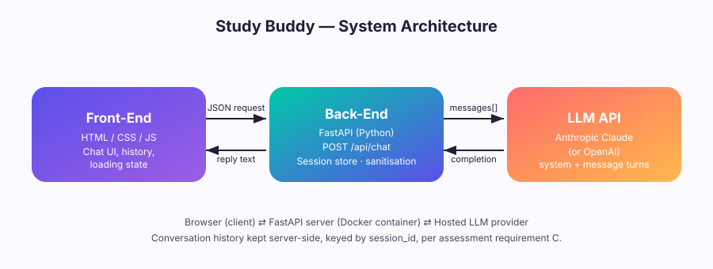

# Study Buddy

A web-based LLM chatbot built for COIT12204 Assessment 2. Study Buddy is a
friendly study assistant with a chat UI, a FastAPI backend, and a
persistent per-session conversation with Claude.



## Live demo

- Chat UI: https://study-buddy-2-hu7v.onrender.com
- Backend health check: https://study-buddy-1-0wmr.onrender.com/api/health

## Features

- Clean, colourful chat interface (HTML/CSS/JS) with message history,
  a "typing…" loading state, and quick-prompt shortcuts.
- FastAPI backend exposing `POST /api/chat`.
- Session-based conversation history kept server-side.
- Basic input sanitisation to reduce prompt-injection risk.
- Configurable system persona ("Study Buddy") that avoids Markdown
  formatting so replies render cleanly as plain text in the chat bubble.
- Powered by Anthropic's Claude API.
- Dockerised for one-command local deployment, and deployed live on Render
  (backend as a Web Service, frontend as a static Web Service).

## Project structure

```
study-buddy/
├── backend/
│   ├── main.py            # FastAPI app, /api/chat, /api/health, /api/reset
│   ├── requirements.txt
│   ├── Dockerfile
│   └── .env.example
├── frontend/
│   ├── index.html
│   ├── style.css
│   └── script.js
├── docker-compose.yml
├── architecture-diagram.svg
└── README.md
```

## 1. Run locally without Docker (fastest for development)

```bash
cd backend
python -m venv venv
source venv/bin/activate        # Windows: venv\Scripts\activate
pip install -r requirements.txt
cp .env.example .env            # then paste your Anthropic API key into .env
uvicorn main:app --reload
```

Backend is now on `http://localhost:8000`.

Open `frontend/index.html` directly in your browser (or serve it, e.g.
`python -m http.server 8080` from inside `frontend/`), then visit
`http://localhost:8080`.

## 2. Run with Docker (recommended for the deployment requirement)

```bash
cd study-buddy
cp backend/.env.example backend/.env   # add your Anthropic API key
docker compose up --build
```

- Front-end: http://localhost:8080
- Backend API: http://localhost:8000/api/health

Stop with `docker compose down`.

## 3. Configuration

Set these in `backend/.env`:

| Variable | Description |
|---|---|
| `LLM_PROVIDER` | `anthropic` |
| `ANTHROPIC_API_KEY` | sk-ant-.......4PEieQAA |
| `MODEL_NAME` | Model id, e.g. `claude-sonnet-4-6` |

## 4. Design decisions

- **FastAPI** was chosen for its async support, automatic OpenAPI docs,
  and Pydantic validation, which made request/response typing and
  input-length limits straightforward to enforce.
- **Server-side, session-based history** (keyed by a `session_id` the
  client stores in `localStorage`) keeps conversation state out of the
  browser so the system prompt and full context can't be tampered with
  client-side.
- **Basic sanitisation** strips control characters, caps message length,
  and neutralises role-spoofing strings (e.g. `"system:"`,
  `"### instruction"`) before a message is added to the conversation —
  a lightweight but real mitigation appropriate for the assessment scope.
- **Anthropic Claude** is called directly via the official SDK, with the
  system persona instructed to avoid Markdown so the plain-text chat
  bubble never shows raw formatting symbols.
- **Docker Compose** runs the API and a static Nginx front-end as two
  containers locally, matching the "front-end → back-end → LLM API"
  architecture; the same two components are deployed separately on
  Render for the live demo.

## 5. Deployment notes

The project is deployed on Render as two services:
- A **Web Service** for the backend (Docker runtime, root directory
  `backend`, Dockerfile path `backend/Dockerfile`), with
  `ANTHROPIC_API_KEY`, `LLM_PROVIDER`, and `MODEL_NAME` set as
  environment variables in the Render dashboard.
- A **Web Service** for the frontend (Python runtime, root directory
  `frontend`, start command `python3 -m http.server $PORT`), with
  `frontend/script.js`'s `API_BASE` pointed at the backend's live URL.

## 6. AI usage statement

This project was built with the assistance of Claude (Anthropic), used to:
- scaffold the FastAPI backend structure and the sanitisation logic,
- design and implement the front-end chat UI and styling,
- write the Docker/Compose configuration and this README,
- diagnose and fix real issues during development and deployment
  (environment variable loading order, an incompatible SDK version, a
  CSS specificity bug, unrendered Markdown output, and Render build/start
  command configuration),
- draft the accompanying technical report for editing and review.

All AI-assisted code was reviewed and tested — locally and against the
live Render deployment — before submission.
